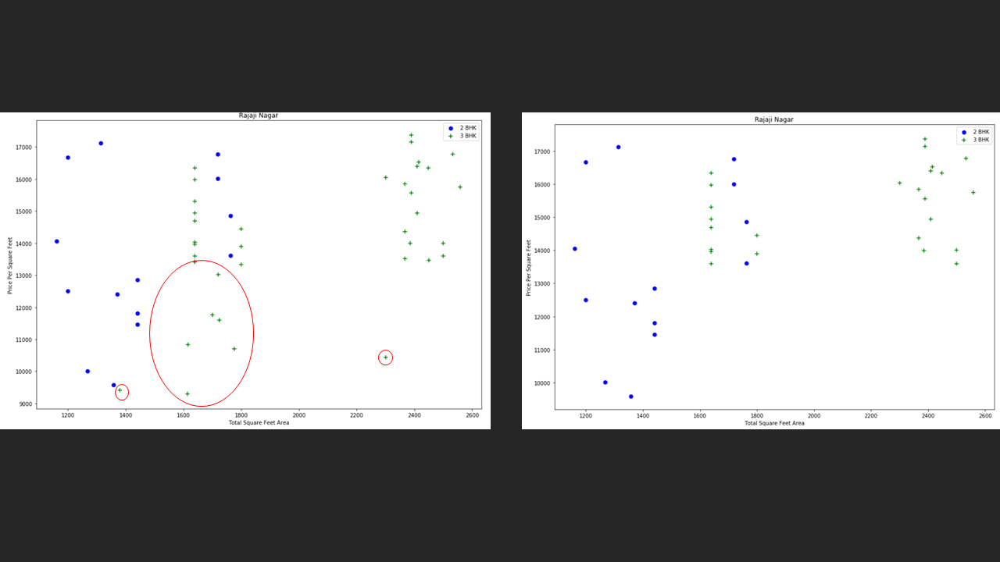

In this data science project, the main aim is to develop a machine learning model that can predict the house price based on different factors like location, square feet area, number of bedroom/bathroom, etc. A model is build using sklearn and linear regression using home prices dataset from kaggle.com. then, During model building most of the data science concepts such as loading the data, preprocessing and cleaning, outlier detection and removal, feature engineering, dimensionality reduction, gridsearchcv for hyperparameter tunning, k fold cross validation, data visualization, etc. are used.

 

Further efforts that is to be considered for the fulfillment of the buisness development of the project is to make a web application that GET and POST HTTP requests through servers and predict the house prices for users, so that they can make estimate depending on their budget. 

Technology and tools wise this project covers,

1. Python as programming language
2. Numpy and Pandas for data cleaning
3. Matplotlib for data visualization
4. Sklearn for model building
5. and Jupyter notebook.

